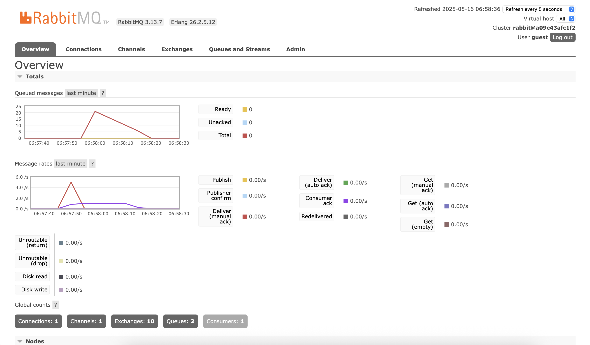
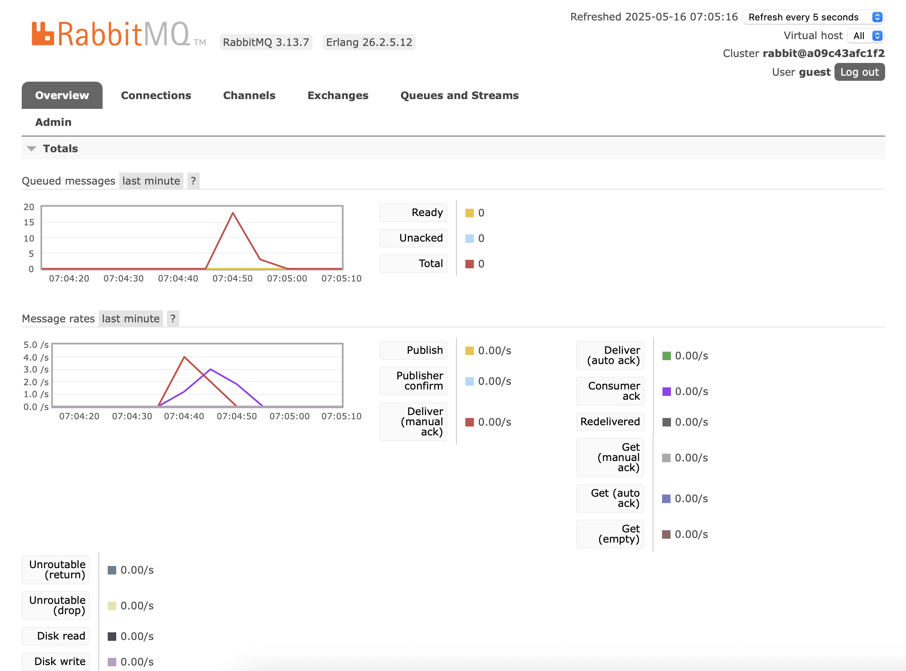

# adpro-module9-subscriber

### 1. What is amqp?

It is a open standard protocol that allows messaging interoperability between systems. It allows the client applications talk to the server and interact. It defines a se tof message capabilities which must be made available by an AMQP compliant server implementation. 

### 2. What does it mean? guest:guest@localhost:5672 , what is the first guest, and what is the second guest, and what is localhost:5672 is for? 

It is an connection URI used to connect to an AMQP broker like RabbitMQ. The first `guest` in the url is the username, while the second `guest` in the url is the password. In `localhost:5672`, the `localhost` is the AMQP server that is running on our system, and `5672` acts as the default port for AMQP. 

I got 20 queues because I ran `cargo run` at least 5 times in the publisher. Since the subscriber processes messages more slowly than the sending speed of publisher, the incoming messages accumulate in the queue because subscriber can handle them. 

Now, with multiple subscriber consoles opened, my queue reduced to around 17 after running it at least 5 times. This is because RabbitMQ assigns each message to the available subscribes, and once a message is delievered to a subscriber, it becomes removed from the queue. 